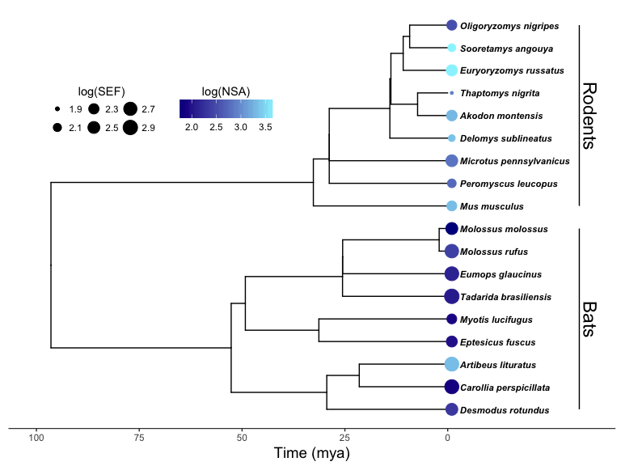

Regression with phylogenetic covariance
================
Lucas Nell
2017-03-16

-   [Morphometric measurements](#morphometric-measurements)
-   [Phylogenetic tree](#phylogenetic-tree)
    -   [Visualizing tree](#visualizing-tree)
-   [Fitting phylogenetic linear models](#fitting-phylogenetic-linear-models)
-   [Model output](#model-output)
    -   [Summaries](#summaries)
    -   [P-values](#p-values)
-   [Session info](#session-info)

Loading packages:

``` r
suppressPackageStartupMessages({
    library(readr)
    library(dplyr)
    library(tidyr)
    library(magrittr)
    library(phylolm)
    library(ape)
    library(nlme)
    library(ggplot2)
    library(ggtree)
})
```

Morphometric measurements
-------------------------

Cleaning `morphometrics.csv` file for use and providing a useful function to retrieve columns from it

``` r
source('tidy_csv.R')

morph_df
```

    ## # A tibble: 1,479 × 7
    ##           diet   taxa                species individual   measure   pos
    ##          <chr>  <chr>                  <chr>      <chr>     <chr> <chr>
    ## 1   Omnivorous Rodent       Akodon montensis        Ak1 body mass  <NA>
    ## 2   Omnivorous Rodent       Akodon montensis        Ak2 body mass  <NA>
    ## 3   Omnivorous Rodent       Akodon montensis        Ak3 body mass  <NA>
    ## 4   Omnivorous Rodent       Akodon montensis        Ak4 body mass  <NA>
    ## 5  Herbivorous    Bat     Artibeus lituratus        Ar1 body mass  <NA>
    ## 6  Herbivorous    Bat     Artibeus lituratus        Ar2 body mass  <NA>
    ## 7  Herbivorous    Bat     Artibeus lituratus        Ar3 body mass  <NA>
    ## 8  Herbivorous    Bat Carollia perspicillata        Cp1 body mass  <NA>
    ## 9  Herbivorous    Bat Carollia perspicillata        Cp2 body mass  <NA>
    ## 10 Herbivorous    Bat Carollia perspicillata        Cp3 body mass  <NA>
    ## # ... with 1,469 more rows, and 1 more variables: value <dbl>

All measures found in `morph_df`:

-   villus height
-   villus width
-   crypt width
-   enterocytes per surface area
-   sef
-   intestinal diameter
-   intestinal length
-   nsa
-   body mass
-   total villa surface area
-   enterocite width

I am only analyzing three: nsa, sef, and body mass. Now I create a data frame with just these columns and their log\_transformed versions. Species names are row names because `phylolm` requires that.

``` r
sp_df <- prep_df(measures = c('nsa', 'sef', 'body mass'))
head(sp_df)
```

    ##                               diet taxa                species  nsa_log
    ## Artibeus lituratus     Herbivorous  Bat     Artibeus lituratus 3.332184
    ## Carollia perspicillata Herbivorous  Bat Carollia perspicillata 1.864253
    ## Desmodus rotundus          Protein  Bat      Desmodus rotundus 2.328411
    ## Eumops glaucinus           Protein  Bat       Eumops glaucinus 2.118181
    ## Molossus molossus          Protein  Bat      Molossus molossus 1.741056
    ## Molossus rufus             Protein  Bat         Molossus rufus 2.402921
    ##                         sef_log body_mass_log       nsa      sef body_mass
    ## Artibeus lituratus     2.843188      4.238070 28.198667 17.18214  69.58333
    ## Carollia perspicillata 2.864234      2.851993  6.476729 17.57634  17.87500
    ## Desmodus rotundus      2.514819      3.645569 10.427806 12.38064  38.50000
    ## Eumops glaucinus       2.829131      3.530470  8.316000 16.93075  34.14000
    ## Molossus molossus      2.528073      2.592077  5.790889 12.56904  13.49000
    ## Molossus rufus         2.755809      3.513931 11.055417 15.73377  33.58000

Phylogenetic tree
-----------------

Reading phylogenetic tree, cleaning species names, and removing unnecessary species from it

``` r
tr <- read.tree('tree.nwk')
tr$tip.label <- gsub('_', ' ', tr$tip.label)
tr <- drop.tip(tr, tip = tr$tip.label[!tr$tip.label %in% (morph_df$species %>% unique)])
tr
```

    ## 
    ## Phylogenetic tree with 18 tips and 17 internal nodes.
    ## 
    ## Tip labels:
    ##  Carollia perspicillata, Artibeus lituratus, Desmodus rotundus, Eptesicus fuscus, Myotis lucifugus, Molossus rufus, ...
    ## Node labels:
    ##  , '8', '13', '14', '22', '11', ...
    ## 
    ## Rooted; includes branch lengths.

#### Visualizing tree

Here is the phylogenetic tree with log(NSA) as tip color and log(SEF) as tip size.



Fitting phylogenetic linear models
----------------------------------

Below fits phylogenetic linear regression models using `phylolm::phylolm`. For both nsa and sef (log-transformed), I fit models using log-transformed body mass and taxa (a factor based on whether that species is a rodent or bat) as covariates. (I tried including the interaction between body mass and taxa, but it increased the AIC in all models.)

I fit two types of phylogenetic-covariance models for both nsa and sef regression models: "the Ornstein-Uhlenbeck model with an ancestral state to be estimated at the root (OUfixedRoot) ... \[and\] Pagel's lambda model." (see `phylolm` documentation) As you can see from the results below, the covariance model had little effect on our conclusions.

I also ran 2,000 parametric bootstrap replicates to estimate model parameters.

The code below takes ~10 minutes to run.

``` r
set.seed(352)
nsa_fits <- lapply(c('lambda', 'OUfixedRoot'), 
                  function(m) {
                      phylolm(nsa_log ~ body_mass_log + taxa, data = sp_df, phy = tr,
                              model = m, boot = 2000, 
                              upper.bound = ifelse(m == 'lambda', 1.2, Inf))})
names(nsa_fits) <- c('lambda', 'ou')
sef_fits <- lapply(c('lambda', 'OUfixedRoot'), 
                   function(m) {
                       phylolm(sef_log ~ body_mass_log + taxa, data = sp_df, phy = tr,
                               model = m, boot = 2000,
                               upper.bound = ifelse(m == 'lambda', 1.2, Inf))})
names(sef_fits) <- c('lambda', 'ou')
save(nsa_fits, sef_fits, file = 'model_fits.RData', compress = FALSE)
```

Model output
------------

### Summaries

#### NSA

**Pagel's lambda**

``` r
summary(nsa_fits[['lambda']])
```

    ## 
    ## Call:
    ## phylolm(formula = nsa_log ~ body_mass_log + taxa, data = sp_df, 
    ##     phy = tr, model = m, upper.bound = ifelse(m == "lambda", 
    ##         1.2, Inf), boot = 2000)
    ## 
    ##    AIC logLik 
    ## 10.826 -0.413 
    ## 
    ## Raw residuals:
    ##      Min       1Q   Median       3Q      Max 
    ## -0.46973 -0.16573 -0.01707  0.14016  0.50960 
    ## 
    ## Mean tip height: 96.46239
    ## Parameter estimate(s) using ML:
    ## lambda : 1e-07
    ## sigma2: 0.0006354724 
    ## 
    ## Coefficients:
    ##               Estimate   StdErr  t.value lowerbootCI upperbootCI  p.value
    ## (Intercept)    0.46555  0.33661  1.38305    -0.14208      1.0466 0.186891
    ## body_mass_log  0.55616  0.10451  5.32140     0.37210      0.7421 8.55e-05
    ## taxaRodent     0.53124  0.15099  3.51833     0.26848      0.8001 0.003105
    ##                  
    ## (Intercept)      
    ## body_mass_log ***
    ## taxaRodent    ** 
    ## ---
    ## Signif. codes:  0 '***' 0.001 '**' 0.01 '*' 0.05 '.' 0.1 ' ' 1
    ## 
    ## Note: p-values are conditional on lambda=1e-07.
    ## 
    ## sigma2: 0.0006354724
    ##       bootstrap mean: 0.0005418981 (on raw scale)
    ##                       0.0005066157 (on log scale, then back transformed)
    ##       bootstrap 95% CI: (0.0002412875,0.001007715)
    ## 
    ## lambda: 1e-07
    ##       bootstrap mean: 0.003704019 (on raw scale)
    ##       bootstrap 95% CI: (1e-07,1e-07)
    ## 
    ## Parametric bootstrap results based on 2000 fitted replicates

**Ornstein-Uhlenbeck**

``` r
summary(nsa_fits[['ou']])
```

    ## 
    ## Call:
    ## phylolm(formula = nsa_log ~ body_mass_log + taxa, data = sp_df, 
    ##     phy = tr, model = m, upper.bound = ifelse(m == "lambda", 
    ##         1.2, Inf), boot = 2000)
    ## 
    ##     AIC  logLik 
    ## 10.5299 -0.2649 
    ## 
    ## Raw residuals:
    ##      Min       1Q   Median       3Q      Max 
    ## -0.46184 -0.18192 -0.02546  0.15220  0.47670 
    ## 
    ## Mean tip height: 96.46239
    ## Parameter estimate(s) using ML:
    ## alpha: 0.132737
    ## sigma2: 0.01640745 
    ## 
    ## Coefficients:
    ##               Estimate   StdErr  t.value lowerbootCI upperbootCI   p.value
    ## (Intercept)    0.40545  0.32698  1.24002    -0.16159      0.9678  0.234018
    ## body_mass_log  0.57810  0.10074  5.73861     0.39858      0.7594 3.919e-05
    ## taxaRodent     0.50513  0.15504  3.25813     0.22918      0.7919  0.005294
    ##                  
    ## (Intercept)      
    ## body_mass_log ***
    ## taxaRodent    ** 
    ## ---
    ## Signif. codes:  0 '***' 0.001 '**' 0.01 '*' 0.05 '.' 0.1 ' ' 1
    ## 
    ## Note: p-values are conditional on alpha=0.132737.
    ## 
    ## sigma2: 0.01640745
    ##       bootstrap mean: 2.681025 (on raw scale)
    ##                       0.05459009 (on log scale, then back transformed)
    ##       bootstrap 95% CI: (0.002771106,3.214493)
    ## 
    ## alpha: 0.132737
    ##       bootstrap mean: 32.22212 (on raw scale)
    ##                       0.5711749 (on log scale, then back transformed)
    ##       bootstrap 95% CI: (0.03313965,33.0764)
    ## 
    ## Parametric bootstrap results based on 2000 fitted replicates

#### SEF

**Pagel's lambda**

``` r
summary(sef_fits[['lambda']])
```

    ## 
    ## Call:
    ## phylolm(formula = sef_log ~ body_mass_log + taxa, data = sp_df, 
    ##     phy = tr, model = m, upper.bound = ifelse(m == "lambda", 
    ##         1.2, Inf), boot = 2000)
    ## 
    ##    AIC logLik 
    ##   1.06   4.47 
    ## 
    ## Raw residuals:
    ##      Min       1Q   Median       3Q      Max 
    ## -0.28887 -0.20120  0.04456  0.11970  0.32898 
    ## 
    ## Mean tip height: 96.46239
    ## Parameter estimate(s) using ML:
    ## lambda : 1e-07
    ## sigma2: 0.000369379 
    ## 
    ## Coefficients:
    ##                Estimate    StdErr   t.value lowerbootCI upperbootCI
    ## (Intercept)    2.271598  0.256632  8.851572    1.805807      2.7292
    ## body_mass_log  0.124701  0.079682  1.564987   -0.018942      0.2677
    ## taxaRodent    -0.507308  0.115118 -4.406861   -0.717428     -0.3054
    ##                 p.value    
    ## (Intercept)   2.425e-07 ***
    ## body_mass_log 0.1384350    
    ## taxaRodent    0.0005099 ***
    ## ---
    ## Signif. codes:  0 '***' 0.001 '**' 0.01 '*' 0.05 '.' 0.1 ' ' 1
    ## 
    ## Note: p-values are conditional on lambda=1e-07.
    ## 
    ## sigma2: 0.000369379
    ##       bootstrap mean: 0.0003057477 (on raw scale)
    ##                       0.0002854995 (on log scale, then back transformed)
    ##       bootstrap 95% CI: (0.0001249149,0.0005643484)
    ## 
    ## lambda: 1e-07
    ##       bootstrap mean: 0.002138407 (on raw scale)
    ##       bootstrap 95% CI: (1e-07,1e-07)
    ## 
    ## Parametric bootstrap results based on 2000 fitted replicates

**Ornstein-Uhlenbeck**

``` r
summary(sef_fits[['ou']])
```

    ## 
    ## Call:
    ## phylolm(formula = sef_log ~ body_mass_log + taxa, data = sp_df, 
    ##     phy = tr, model = m, upper.bound = ifelse(m == "lambda", 
    ##         1.2, Inf), boot = 2000)
    ## 
    ##    AIC logLik 
    ##   1.06   4.47 
    ## 
    ## Raw residuals:
    ##      Min       1Q   Median       3Q      Max 
    ## -0.28887 -0.20120  0.04456  0.11970  0.32898 
    ## 
    ## Mean tip height: 96.46239
    ## Parameter estimate(s) using ML:
    ## alpha: 4.046316
    ## sigma2: 0.28835 
    ## 
    ## Coefficients:
    ##                Estimate    StdErr   t.value lowerbootCI upperbootCI
    ## (Intercept)    2.271598  0.256632  8.851572    1.828177      2.7455
    ## body_mass_log  0.124701  0.079682  1.564987   -0.018659      0.2671
    ## taxaRodent    -0.507308  0.115118 -4.406862   -0.700808     -0.2977
    ##                 p.value    
    ## (Intercept)   2.425e-07 ***
    ## body_mass_log 0.1384350    
    ## taxaRodent    0.0005099 ***
    ## ---
    ## Signif. codes:  0 '***' 0.001 '**' 0.01 '*' 0.05 '.' 0.1 ' ' 1
    ## 
    ## Note: p-values are conditional on alpha=4.046316.
    ## 
    ## sigma2: 0.28835
    ##       bootstrap mean: 7.623057 (on raw scale)
    ##                       0.08501182 (on log scale, then back transformed)
    ##       bootstrap 95% CI: (0.001761882,7.853593)
    ## 
    ## alpha: 4.046316
    ##       bootstrap mean: 105.3404 (on raw scale)
    ##                       1.549017 (on log scale, then back transformed)
    ##       bootstrap 95% CI: (0.0405296,126.7767)
    ## 
    ## Parametric bootstrap results based on 2000 fitted replicates

### P-values

These are p-value based on bootstrap replicates for whether the coefficient for the taxa covariate is significantly different from zero. P-values are presented for the Pagel's lambda then Ornstein-Uhlenbeck covariance models.

#### NSA

``` r
mean(nsa_fits[['lambda']]$bootstrap[,'taxaRodent'] < 0) * 2
```

    ## [1] 0.001

``` r
mean(nsa_fits[['ou']]$bootstrap[,'taxaRodent'] < 0) * 2
```

    ## [1] 0.001

#### SEF

``` r
mean(sef_fits[['lambda']]$bootstrap[,'taxaRodent'] > 0) * 2
```

    ## [1] 0

``` r
mean(sef_fits[['ou']]$bootstrap[,'taxaRodent'] > 0) * 2
```

    ## [1] 0

Session info
============

This outlines the package versions I used for these analyses.

``` r
devtools::session_info()
```

    ## Session info --------------------------------------------------------------

    ##  setting  value                       
    ##  version  R version 3.3.2 (2016-10-31)
    ##  system   x86_64, darwin13.4.0        
    ##  ui       X11                         
    ##  language (EN)                        
    ##  collate  en_US.UTF-8                 
    ##  tz       America/Chicago             
    ##  date     2017-03-16

    ## Packages ------------------------------------------------------------------

    ##  package    * version date       source        
    ##  ape        * 4.1     2017-02-14 CRAN (R 3.3.2)
    ##  assertthat   0.1     2013-12-06 CRAN (R 3.3.0)
    ##  backports    1.0.5   2017-01-18 CRAN (R 3.3.2)
    ##  colorspace   1.3-2   2016-12-14 CRAN (R 3.3.2)
    ##  DBI          0.6     2017-03-09 CRAN (R 3.3.2)
    ##  devtools     1.12.0  2016-06-24 CRAN (R 3.3.0)
    ##  digest       0.6.12  2017-01-27 CRAN (R 3.3.2)
    ##  dplyr      * 0.5.0   2016-06-24 CRAN (R 3.3.0)
    ##  evaluate     0.10    2016-10-11 CRAN (R 3.3.0)
    ##  ggplot2    * 2.2.1   2016-12-30 CRAN (R 3.3.2)
    ##  ggtree     * 1.6.9   2017-01-21 Bioconductor  
    ##  gtable       0.2.0   2016-02-26 CRAN (R 3.3.0)
    ##  htmltools    0.3.5   2016-03-21 CRAN (R 3.3.0)
    ##  jsonlite     1.3     2017-02-28 CRAN (R 3.3.2)
    ##  knitr        1.15.1  2016-11-22 CRAN (R 3.3.2)
    ##  labeling     0.3     2014-08-23 CRAN (R 3.3.0)
    ##  lattice      0.20-34 2016-09-06 CRAN (R 3.3.2)
    ##  lazyeval     0.2.0   2016-06-12 CRAN (R 3.3.0)
    ##  magrittr   * 1.5     2014-11-22 CRAN (R 3.3.0)
    ##  memoise      1.0.0   2016-01-29 CRAN (R 3.3.0)
    ##  munsell      0.4.3   2016-02-13 CRAN (R 3.3.0)
    ##  nlme       * 3.1-131 2017-02-06 CRAN (R 3.3.2)
    ##  phylolm    * 2.5     2016-10-17 CRAN (R 3.3.0)
    ##  plyr         1.8.4   2016-06-08 CRAN (R 3.3.0)
    ##  R6           2.2.0   2016-10-05 CRAN (R 3.3.0)
    ##  Rcpp         0.12.9  2017-01-14 CRAN (R 3.3.2)
    ##  readr      * 1.0.0   2016-08-03 CRAN (R 3.3.0)
    ##  rmarkdown    1.3     2016-12-21 CRAN (R 3.3.2)
    ##  rprojroot    1.2     2017-01-16 CRAN (R 3.3.2)
    ##  scales       0.4.1   2016-11-09 CRAN (R 3.3.2)
    ##  stringi      1.1.2   2016-10-01 CRAN (R 3.3.0)
    ##  stringr      1.2.0   2017-02-18 CRAN (R 3.3.2)
    ##  tibble       1.2     2016-08-26 CRAN (R 3.3.0)
    ##  tidyr      * 0.6.1   2017-01-10 CRAN (R 3.3.2)
    ##  withr        1.0.2   2016-06-20 CRAN (R 3.3.0)
    ##  yaml         2.1.14  2016-11-12 CRAN (R 3.3.2)
