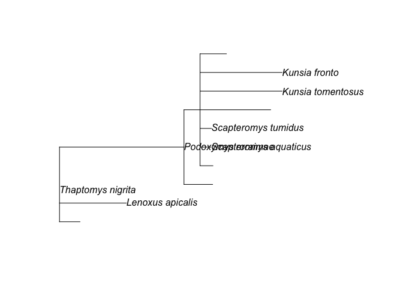
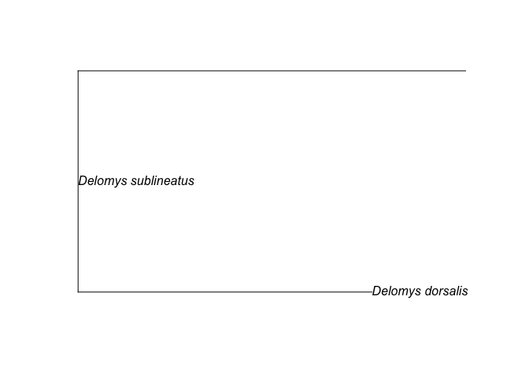

Rodent phylogenetic tree
================
Lucas Nell
2017-01-06

Background
==========

The mammal paper Antonio referenced [(Bininda-Emonds et al. 2007)](http://dx.doi.org/10.1038/nature05634) has 6 of the 10 focal rodent species.

Another paper [(Fabre et al. 2012)](http://dx.doi.org/10.1186/1471-2148-12-88) has all of them, but this tree appears quite different from the others (branch tips do not extend to the same location horizontally; I believe this is because it is based on genetic distances rather than time). Some species are also located on nodes, rather than branch tips (see plots below for a visualization), and some edge lengths are missing. I'm not sure how to resolve any of these issues.

A last paper [(Schenk et al. 2013)](http://sysbio.oxfordjournals.org/content/62/6/837) has 6 of the 10 rodents, as well, but they don't entirely overlap with those from the mammal paper.

*Akodon montensis* and *Euryoryzomys russatus* are the two species present in neither the Bininda-Emonds nor the Schenk trees.

Preamble
========

I first need to `source` the `'tree_preamble.R'` file to load necessary R packages and make the data frame of species names.

``` r
source('tree_preamble.R')
```

Schenk tree
===========

``` r
schenk <- get_study(study_id = 'pg_2859', object_format = 'phylo')
schenk$tip.label <- gsub('_', ' ', schenk$tip.label)
schenk
```


    Phylogenetic tree with 305 tips and 304 internal nodes.

    Tip labels:
        Mastomys erythroleucus, Mastomys hildebrandtii, Stenocephalemys albipes, Myomyscus brockmani, Colomys goslingi, Zelotomys hildegardeae, ...

    Rooted; includes branch lengths.

Fabre tree
==========

Downloading tree
----------------

Using `rotl` directly didn't work for this paper's tree, so I downloaded the Newick version directly from the link on [OTOL's site](https://tree.opentreeoflife.org/curator/study/view/pg_2688/?tab=metadata). The below code chunk is in bash (i.e., via Terminal in macOS).

``` bash
wget "https://api.opentreeoflife.org/v3/study/pg_2688.tre"
mv pg_2688.tre rodents.tre
```

I then opened this file in a text editor and removed all single quotes and replaced all spaces with underscores. This allows R to read this file appropriately. After it's read, I can replace underscores with spaces.

``` r
rod_tr <- read.tree('rodents.tre')
rod_tr$tip.label <- gsub('_', ' ', rod_tr$tip.label)
rod_tr$node.label <- gsub('_', ' ', rod_tr$node.label)
```

Attempting to correct for missing edge lengths
----------------------------------------------

I set edge lengths of `NA` to zero, then used `di2multi` to collapse these into multichotomies.

``` r
rod_tr$edge.length[is.na(rod_tr$edge.length)] <- 0
rod_tr <- di2multi(rod_tr) %>% 
    # Also removing unnecessary tips
    drop.tip(., tip = c(2260:2165, 685, 686))
rod_tr
```


    Phylogenetic tree with 2162 tips and 1381 internal nodes.

    Tip labels:
        Myomimus roachi, Myomimus setzeri, Myomimus personatus, Eliomys munbyanus, Eliomys melanurus, , ...
    Node labels:
        , Hystrix africaeaustralis, Sciurus niger, Chaetocauda sichuanensis, Eliomys quercinus, , ...

    Unrooted; includes branch lengths.

Drawing tree
------------

If you want to make a pdf of this tree that's (somewhat) readable:

``` r
font_size <- 0.05
pdf('rod_tree.pdf', width = 6, height = 24)
    plot(rod_tr, cex = font_size, edge.width = 0.25, no.margin = TRUE, label.offset = 0.5)
    nodelabels(frame = 'none', cex = font_size, adj = c(1, 0))
    tiplabels(frame = 'none', cex = font_size, adj = c(0, 0.5))
dev.off()
```

Checking species presence in tree
---------------------------------

Three species initially don't seem to be present in either node or tip labels.

``` r
sp_df$species[sp_df$type == 'rodent' & 
                  !sp_df$species %in% c(rod_tr$node.label, rod_tr$tip.label)]
```

    [1] "Olygoryzomys nigripes" "Sooretamys angouya"    "Euryoryzomys russatus"

However, looking these up in the OTOL database, I found the following:

-   *Olygoryzomys nigripes* is spelled *Oligoryzomys nigripes* ([link](https://tree.opentreeoflife.org/taxonomy/browse?id=752853))
-   *Sooretamys angouya* is synonymous with *Oryzomys angouya* ([link](https://tree.opentreeoflife.org/taxonomy/browse?id=1039661))
-   *Euryoryzomys russatus* is synonymous with *Oryzomys russatus* ([link](https://tree.opentreeoflife.org/taxonomy/browse?id=739))

When these are taken into account, all species are found in this tree.

Species names as node labels
----------------------------

The following plots show the three focal species used as node rather than tip labels.

``` r
extract.clade(rod_tr, node = 'Mus musculus') %>% 
    plot.phylo(., show.node.label = TRUE)
```


``` r
extract.clade(rod_tr, node = 'Thaptomys nigrita') %>% 
    plot.phylo(., show.node.label = TRUE)
```



``` r
extract.clade(rod_tr, node = 'Delomys sublineatus') %>% 
    plot.phylo(., show.node.label = TRUE)
```


