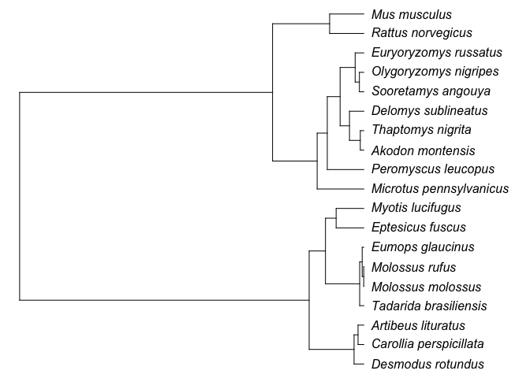
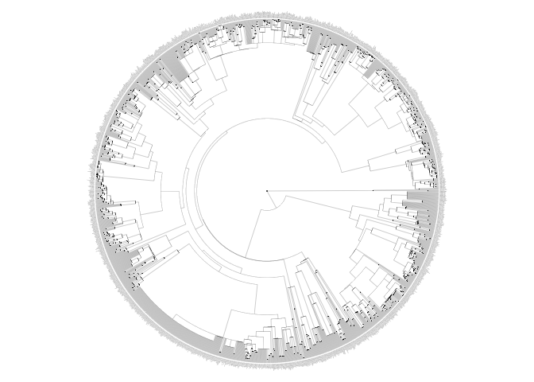

Phylogenetic tree
================
Lucas Nell
2017-01-06

Contents
========

This file contains the following:

1.  A summary of the tree-creation options as I see them currently
2.  Code showing the related portions of the Open Tree of Life phylogeny
3.  Code showing the related portions of the overall mammal tree

Current situation
=================

Below I will outline the 3 options for creating a tree from my current perspective.

### Option 1

The "synthesis" Open Tree of Life (OTOL) contains all focal species. We would just need to choose one subspecies of *Myotis lucifugus* to use.

**The problem:**

This tree doesn't provide branch lengths, which are required to create a covariance matrix. We could use `ape::compute.brlen` to compute branch lengths (see below), but I don't know how accurate that is.

### Option 2

We could start with the mammal tree from [Bininda-Emonds et al. (2007)](http://dx.doi.org/10.1038/nature05634) and fill in rodent and bat species not present here using other studies. See [`rodents.md`](rodents.md) and [`bats.md`](bats.md) for info on studies we could use for these sub-trees.

**The problem:**

There could be problems with just stitching together phylogenies from different studies. The bat tree is great and outwardly appears similar to the overall mammal tree, but the rodent tree that contains all focal species has some issues (see [rodents page](rodents.md)).

### Option 3

We *could* create a phylogeny from sequencing data available online. I'm pretty sure all focal species have sequence data available online, so it's conceivably possible.

**The problem:**

I've never done this, and it might be pretty time-consuming.

Open Tree of Life (OTOL)
========================

I used the package `rotl` to interface with the OTOL to import trees into R. [Here](https://cran.r-project.org/web/packages/rotl/vignettes/data_mashups.html) is a guide on using it.

I first need to `source` the `'tree_preamble.R'` file to load necessary R packages and make the data frame of species names.

``` r
source('tree_preamble.R')
```

Creating tree
-------------

I downloaded OTOL data for the mammalian clade first.

``` r
get_clade <- function(clade_name){
    tol_tr <- tol_subtree(ott_id = tnrs_match_names(names = clade_name)$ott_id)
    tol_tr$tip.label <- strip_ott_ids(tol_tr$tip.label, remove_underscores=TRUE)
    tol_tr$node.label <- sub(" ott\\d+$", "", tol_tr$node.label)
    return(tol_tr)
}

tol_mams <- get_clade('Mammalia')
```

I next computed branch lengths for the entire mammalian clade. Since the calculation is based on the number of "leaves" per subtree, I figured I should do this using as much information as possible.

``` r
tol_mam <- compute.brlen(tol_mams)
```

Aligning species names with tip labels
--------------------------------------

Some species names in `sp_df` are not present in tip labels.

``` r
sp_df$species[!sp_df$species %in% tol_mams$tip.label]
```

    [1] "Mus musculus"            "Rattus norvegicus"      
    [3] "Olygoryzomys nigripes"   "Peromyscus leucopus"    
    [5] "Microtus pennsylvanicus" "Eumops glaucinus"       
    [7] "Tadarida brasiliensis"   "Myotis lucifugus"       

It turns out that this because we need to specify some subspecies and to spell genus names the same. When we do that, they line up fine:

``` r
all(
    'Rattus norvegicus albus' %in% tol_mams$tip.label,
    'Eumops glaucinus floridanus' %in% tol_mams$tip.label,
    'Oligoryzomys nigripes' %in% tol_mams$tip.label,
    'Myotis lucifugus lucifugus' %in% tol_mams$tip.label,
    'Microtus pennsylvanicus pennsylvanicus' %in% tol_mams$tip.label,
    'Mus musculus domesticus' %in% tol_mams$tip.label,
    'Peromyscus leucopus leucopus' %in% tol_mams$tip.label,
    'Tadarida brasiliensis brasiliensis' %in% tol_mams$tip.label
)
```

    [1] TRUE

> *Choosing subspecies*: Within subspecies trees with resolved branches, I chose the subspecies that was on the outer branch, and for those with unresolved or polytomous branches, I chose a subspecies haphazardly.

I next made a data frame of new species/subspecies names and input them into the tree's tip labels, so that they now align with the `species` column in `sp_df`.

``` r
repl_df <- 
'Rattus norvegicus albus,Rattus norvegicus
Eumops glaucinus floridanus,Eumops glaucinus
Oligoryzomys nigripes,Olygoryzomys nigripes
Myotis lucifugus lucifugus,Myotis lucifugus
Microtus pennsylvanicus pennsylvanicus,Microtus pennsylvanicus
Mus musculus domesticus,Mus musculus
Peromyscus leucopus leucopus,Peromyscus leucopus
Tadarida brasiliensis brasiliensis,Tadarida brasiliensis
' %>% 
    read_csv(., col_names = c('orig', 'repl'))

tol_mam$tip.label[tol_mam$tip.label %in% repl_df$orig] <- 
    sapply(tol_mam$tip.label[tol_mam$tip.label %in% repl_df$orig], 
       function(x){ repl_df$repl[repl_df$orig == x] }
    )
```

Lastly, I removed all tips other than the ones in `sp_df$species`.

``` r
to_remove <- tol_mam$tip.label[!tol_mam$tip.label %in% sp_df$species]
tol_mam <- drop.tip(tol_mam, tip = to_remove)
tol_mam
```


    Phylogenetic tree with 19 tips and 18 internal nodes.

    Tip labels:
        Desmodus rotundus, Carollia perspicillata, Artibeus lituratus, Tadarida brasiliensis, Molossus molossus, Molossus rufus, ...
    Node labels:
        Boreoeutheria, , , , , , ...

    Rooted; includes branch lengths.

Now that leaves us with our final tree.

``` r
plot(tol_mam, no.margin = TRUE, label.offset = 0.02)
```



Mammal tree
===========

The overall mammal tree is by [Bininda-Emonds et al. (2007)](http://dx.doi.org/10.1038/nature05634).

I first downloaded the tree from the Supplemental information page (amended "Supplementary Figure 1") and renamed it "mammals.nex". I then read it into R and fixed tip and node names.

``` r
mam_tr <- read.nexus(file = 'mammals.nex')
mam_tr$tip.label <- gsub('_', ' ', mam_tr$tip.label)
mam_tr$node.label <- gsub("'", '', mam_tr$node.label) %>% gsub('_', ' ', .)
mam_tr
```


    Phylogenetic tree with 4510 tips and 2108 internal nodes.

    Tip labels:
        Tachyglossus aculeatus, Zaglossus bruijni, Ornithorhynchus anatinus, Anomalurus beecrofti, Anomalurus derbianus, Anomalurus pelii, ...
    Node labels:
        1, 2 Monotremata, 3 Tachyglossidae, 4, 5 Eutheria, 6, ...

    Rooted; includes branch lengths.

Rodent and bat species
----------------------

Getting tip numbers for rodent and bat species.

``` r
rods <- getDescendants(
    mam_tr, 
    node = which(grepl('Rodentia', mam_tr$node.label)) + length(mam_tr$tip.label))
rods <- rods[rods <= length(mam_tr$tip.label)]
bats <- getDescendants(
    mam_tr, 
    node = which(grepl('Chiroptera', mam_tr$node.label)) + length(mam_tr$tip.label))
bats <- bats[bats <= length(mam_tr$tip.label)]
```

Drawing tree
------------

If you want to make a pdf of this tree that's (somewhat) readable, with bats in red and rodents in blue:

``` r
font_size <- 0.05
tip_colors <- rep('black', length(mam_tr$tip.label))

tip_colors[rods] <- 'blue'
tip_colors[bats] <- 'red'

pdf('mam_tree.pdf', width = 60, height = 60)
    plot(mam_tr, show.node.label = TRUE, cex = font_size, edge.width = 0.2, 
         type = 'fan', tip.color = tip_colors,
         no.margin = TRUE, label.offset = 1)
dev.off()
```

Tree of bats and rodents

``` r
rod_bat_tr <- drop.tip(
    mam_tr, 
    tip = which((1:length(mam_tr$tip.label)) %in% c(rods, bats)))
plot(rod_bat_tr, cex = 0.05, edge.width = 0.2, type = 'fan', no.margin = TRUE,
     label.offset = 1)
```



<!---
# Combine trees


-->
